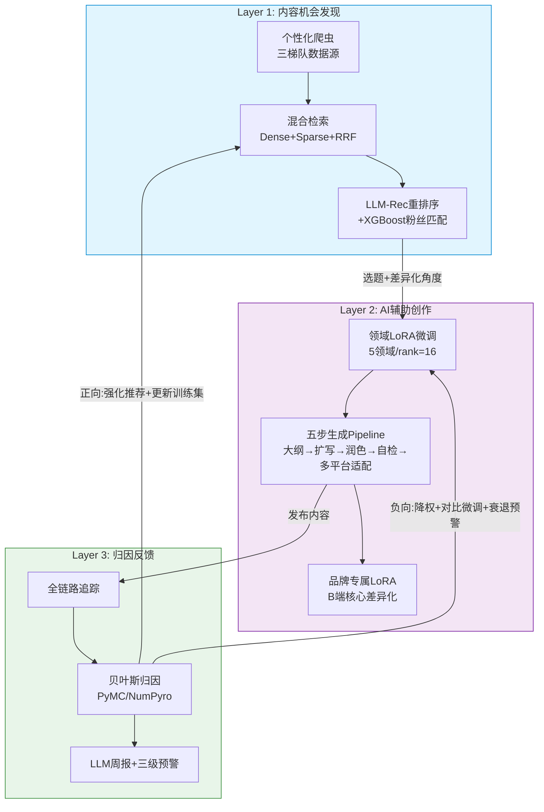

# AI驱动的内容策略引擎 —— 创业机会验证

## 一、机会判断

**目标用户**（三层）：
- 中小商家/品牌方（核心）：年营销预算10-200万，面临"不投流没流量、投了流ROI低"两难，中国超百万级
- 个体KOC/KOL（增长引擎）：粉丝1-50万，"一人成军"，Z世代AIGC使用率92%（司若，N=1005）
- MCN/代运营（高客单增量）：管理10+账号，需批量管理和归因

**核心痛点**：
1. 策略决策盲目——最大痛点不是"不会写"，是"不知道写什么"（李道彬，2026）
2. 种草-拔草转化断链——内容团队只管发、电商只管卖，中间黑箱（罗应中SICAS模型验证购买环节为最大障碍）
3. 同质化+效率瓶颈——传统生产"高门槛、长周期、重投入"（杨如倩，2026）

**为什么现在**：AIGC用户6.02亿、渗透率42.8%；市场不缺ChatGPT/剪映等生成工具，但缺从策略→生产→归因的端到端方案。

## 二、用户证据

| 来源 | 方法 | 核心数据 |
|------|------|----------|
| 司若(2026) | N=1005, KMO=0.912 | AI自我效能解释创作效能58.4%变异量(R²=0.584) |
| 李亚龙(2024) | 小红书问卷+SPSS | 信息获取是种草首要动机，信任度是使用意愿最关键因素 |
| 罗应中(2025) | SICAS+AHP | 购买环节为最大转化障碍 |
| 马毓晨(2025) | 23品牌获奖案例 | "情感共鸣 > 功能评测 > 价格优势"为最高转化公式 |

**平台观察**：小红书用户评论高频词——"和实物不符""广告太多了""千篇一律的文案"。企业AI工具采购后利用率不足40%（林贺斌）。

## 三、MVP架构

产品回答三个问题：**Q1 做什么？→ Q2 怎么做？→ Q3 效果如何？**。三层形成自进化数据闭环。

**关键技术选型**：BGE-large-zh + Milvus Lite + Qwen2.5-7B(LoRA基座) + XGBoost + PyMC/NumPyro + FastAPI + Next.js。硬件：1×RTX 4090。

**MVP边界**：不做实时推荐/全平台/自研大模型/视频生成/全自动发布/社交功能。

## 四、商业判断

**付费逻辑**（三个递进）：降本增效（外包vs AI——中小品牌月省60-80%成本）→ 差异化竞争（算法时代唯一可掌控变量就是内容质量）→ 增长闭环（为"知道每一分钱效果如何"的确定性付费）。关键差异：用户不是买"能写文案的AI"，而是买"懂品类、懂平台规则、能追踪效果"的专用工具（杨如倩，2026）。

**定价**：C端Freemium——0/39/99元/月；B端SaaS——999/2999元/月+企业定制。按价值定价。

**获客**：内容驱动（自有产品即最佳案例+免费SICAS诊断引流）→ 社群渗透（平台合作）→ 标杆裂变。

## 五、2周验证计划

**三个核心假设**：

| 假设 | 验证方法 | Go条件 | No-Go |
|------|----------|--------|-------|
| H1: 策略决策是刚需痛点 | 15人深度访谈+诊断Demo钩子 | ≥60%自发表达策略焦虑 | "只需生成工具" |
| H2: 愿为三合一产品付费 | Fake Door+预售(5-8人)+WOZ模拟 | 预售≥30%或Fake Door>2x均值 | 0人付费 |
| H3: 归因是核心付费驱动力 | 访谈追问归因追踪现状 | ≥50%认为归因"很需要" | "平台够用" |

**时间线**：
- Day1-2: 准备（访谈名单+提纲+诊断Demo）
- Day3-5: 15人深度访谈，必须追问"内容到下单中间发生了什么？你能追踪吗？"
- Day6-7: H1必须通过，H2+H3至少其一通过
- Day8-10: Fake Door(投放≤1000元)+预售+Wizard of Oz(3品牌)三手段并行
- Day11-13: Van Westendorp定价(20人)+Kano功能排序+锁定10-20共创用户
- Day14: Go/No-Go决策。全过→4周MVP上线；H1+H2过→砍归因模块；H1未过→转向

**资源**：产品负责人全职2周 + 全栈开发4天 + 设计2天。现金2000元（投放1000+访谈500+工具500）。

---

**参考文献**：杨如倩(2026)、李道彬(2026)、罗应中(2025)、马毓晨(2025)、司若(2026)、蔡圣涵(2026)、林贺斌、张安琪(2024)、李亚龙(2024)、汪棹桴(2026)、吴晓慧(2026)等14篇
